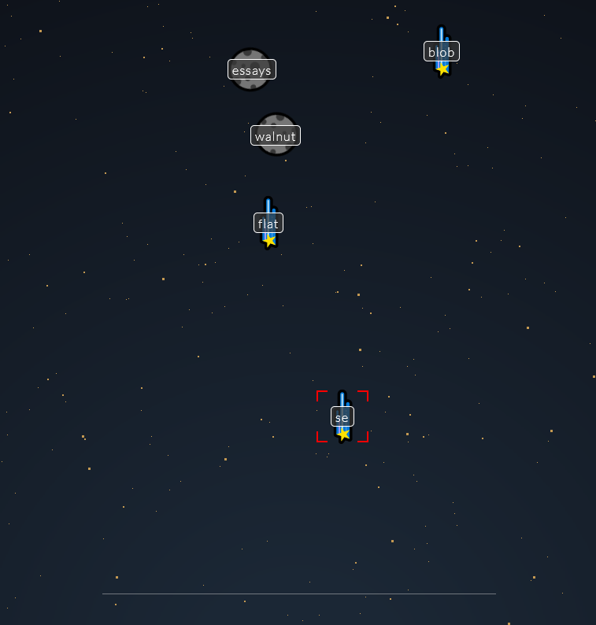

# Browser Game - meteotype

A shower of meteors is headed right toward Earth and threatening world destruction! Grab your keyboard-controlled weirdly powerful laser and destroy the pieces before they land!

https://t-s-w.github.io/meteotype - Click to play

## Tech Stack

* TypeScript (Javascript) - Used to control majority of the game.
    - Game data: Game state stored in a Game Class, the meteors to be destroyed are all Debris classes.
    - DOM Manipulation: Provides the visual animations in the game.
* HTML & CSS - HTML provides the structure of the document objects on the screen, CSS is used to make them look good!
* Vite - development environment used to code the game.

## Game screenshot

## How to Play

Objects will continuously fall down. The objects have words on them; type them out to destroy them before they reach the bottom of the screen. A single one getting through will be game over!

Make your way through multiple waves of falling debris and destroy all of them to save the world!

## Wireframe - Development notes

### Overall takeaways

The main things I learned from this project:

- Development with Vite framework, which loads script files as modules rather than scripts. This means objects are private by default unless exported for use in other modules, which provides a layer of code security and cleanliness.
- Deployment via Github Actions, which use a workflow to deploy the project from code, which is a bit more complex than normal Github Pages deployment which is simply hosting the html and code.
- TypeScript: This is my first project with TypeScript and I learned a lot of good coding practices from the errors that TypeScript would throw when compiling, such as being rigorous and ensuring that the types and properties of the objects being passed into functions are what they are intended to be.

### Deployment

Deployment is done via GitHub Actions, using a workflow that was provided by the Vite Documentation here: https://vitejs.dev/guide/static-deploy.html

### Development

Development was done locally using a Vite TypeScript project as the starting framework. 

The development approach to this game was an OOP (Object-Oriented Programming)-centric one. The operation of the game is controlled by two main object classes, `Debris` and `Game`.

### The Debris Class - basic unit of the game
A `Debris` object forms the most common unit of the game. It has the following properties:

* `id` (num): A unique identifier for Debris that no two Debris will share in one Game.
* `height` (num): Current height (from bottom of screen) of the meteor. If it reaches 0, it has collided and destroyed the planet (lose condition).
* `speed` (num): Higher speeds make faster-falling Debris.
* `word` (str): The word that the player must type to eliminate this meteor.
* `remaining` (arr): Initialised to be `word.split('')`. The remaining letters that need to be typed to destroy the Debris.
* `uiElement`, `uiLabel` (HTML Element): The DOM elements associated with the Debris for animation purposes.
* `collided` (bool): Whether the Debris has fallen to the bottom of the screen. Triggers the lose condition if `true`.
* `posX`, `endX`, `speedX` (num): x-axis movement of the debris. Randomised to provide variety (they don't all fall straight down) 
* `image` (str): Emoji that is used as sprite for the debris
* `type` (num): Type of the Debris; different types have different fall speeds and difficulty.

Debris methods include the following:
* UI control: `spawn` puts a Debris that exists in memory on to the page and actually makes it interactable. `fall` and `setPosition` are used to animate their falling.
* Interaction: `strike` is called if the player types the correct letter and progresses the destruction of the Debris by removing one letter.
* Destruction: `destroy` will remove the current Debris from the game's list of active meteors and play screen, while animating their destruction.
* `spawn` (func): Puts the Debris into play. Makes it active, falling, targetable while creating the DOM elements to make it visble to player.

#### Debris Types

Debris have different types specified in the `Debris.ts` module, to add variety and difficulty to the game.

 1. Type 1 Debris are the basic falling object, with an average word length (5-6) and falling speed.
 2. Type 2 Debris are large and have longer word lengths (9-11) than Type 1. They also break into two smaller debris (3-length words) when destroyed, but fall slower.
 3. Type 3 Debris are small and have shorter word lengths, but fall at triple the speed! Watch out!
 4. Type 4 Debris are the smaller class of Debris that spawn only when Type 2s are destroyed.

### Game State - the Game Class

Upon starting the game, initiate a new `Game` and assign it to `window.gameState`. `gameState` provides the single source of truth for the current state of the game, which may include total points, meteors to be spawned, current spawn wave, etc. A `Game` has the following properties:

* `activeDebris`, `queuedDebris` (arr): Active Debris are those currently on screen and interactable. Queued debris will be spawned at regular intervals depending on current wave.
* `currentTarget` (Debris): Defines the current actively-target Debris, which will be highlighted. Targets cannot be changed; once a Debris is started to be hit, it must be destroyed before hitting any other Debris.
* `gameBoard` (HTML Element): The visual DOM element of the game.
* `debrisIndex` (num): An auto-increasing number that assigns index numbers to debris for reference.
* `gameTimeHandler` (num): The id for the `setInterval` that simulates time flow in the game.
* `systemMessageHandler` (num): The id for the `setTimeout` that displays messages on screen during the game (used to indicate wave starts, etc.)
* `systemMessageQueue` (arr): An array of queued messages to be shown on the game screen.
* `currentWave` (num): The wave # the player is currently on.

And the following methods:

* `keyHandler`, `shoot`, `acquireTarget`: `keyHandler` is the event listener call back for keyboard presses. If no Debris is currently being targeted, use `acquireTarget` to search through all active Debris to target. If one is already targeted, attempt to `shoot` it (which may miss if the player typos). Targets cannot be changed without destroying them.
* `displayMessage` displays messages on screen like wave beginnings, etc.
* `start`, `tick`, `stop`: `tick` is the time progress of the game, `start` and `stop` start and stop the time flow.
* `triggerWin` and `triggerFail` cause the game to end and display the corresponding screens.